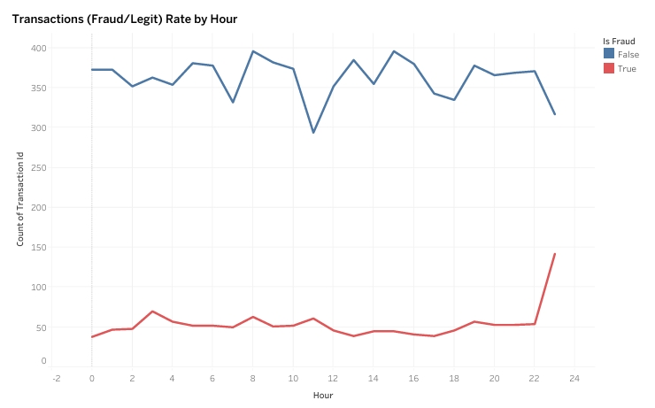
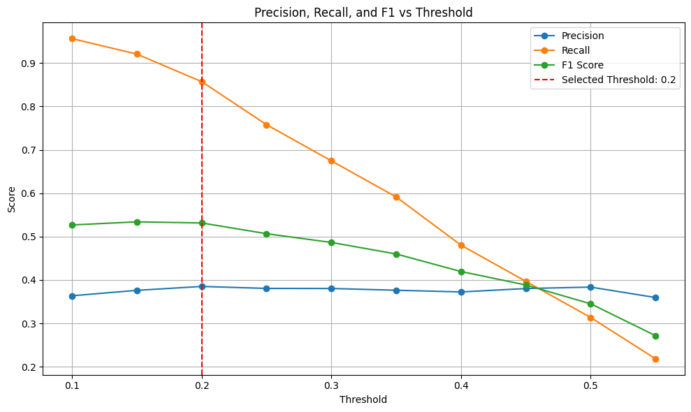

# 🚨 PaySwift Fraud Detection Pipeline

A machine learning pipeline to detect fraudulent transactions for **PaySwift**, a Nigerian fintech startup.  
Using Random Forest with SMOTE and threshold tuning, we achieved **86% recall**, catching **216 out of 252 frauds** — saving **₦8.21M** in financial losses.

---

## 🏦 About PaySwift
PaySwift is a fast-growing Nigerian fintech company that processes thousands of digital transactions daily.  
Facing a **13% fraud rate** (₦38K avg. loss per case), the company relies on its **operations team** to manually review flagged transactions.  
Each **false positive** costs ₦5K in ops time, creating operational strain.

This project delivers an ML pipeline to:
- ✅ Maximize fraud detection
- ✅ Minimize false positives
- ✅ Support ops with actionable insights

---

## 🎯 Objectives
- **Detect More Frauds** → Maximize recall to minimize ₦38K per fraud loss  
- **Reduce Review Load** → Lower FPs to cut ₦5K per case from ops budget  
- **Ensure Trust** → Deliver high AUC-ROC to satisfy exec-level scrutiny  
- **Surface Patterns** → Provide clear, visual fraud trends (region, hour, user behavior)

---

## 📦 Dataset Overview
- **Type**: Synthetic (10,000 PaySwift-like transactions)  
- **Fraud Rate**: 13% (1,301 fraud, 8,699 legit)  
- **Test Set**: 2,000 transactions (252 fraud, 1,748 legit)  
- **Key Features**:
  - `amount`, `hour`, `region`, `type`, `failed_attempts`, `account_age_days`
  - Engineered: `time_of_day`, `user_fraud_count`

---

## 🔍 Methodology
1. 🧪 EDA in SQL + Python: Fraud spikes at 23:00 (31%), 39% of frauds from repeat users  
2. 🔧 Feature Engineering: Categorical encoding, `time_of_day`, normalizations  
3. 🤖 Models Tested:  
   - Random Forest (Plain, Class-Balanced, SMOTE)  
   - Logistic Regression (SMOTE)  
   - XGBoost (SMOTE)  
4. ⚖️ Class Imbalance: Handled using SMOTE  
5. 🎯 Threshold Tuning: Optimized to 0.20 for high recall  
6. 📈 Evaluation Metrics: Recall, Precision, F1, AUC-ROC, FP cost impact  
7. 📊 Visualization: Tableau dashboard + matplotlib PR curves

---

## Results

| Metric              | Value              |
|---------------------|--------------------|
| **Model**           | Random Forest (SMOTE) |
| **Threshold**       | 0.20               |
| **Recall (Fraud)**  | 86% (216/252)      |
| **Precision (Fraud)** | 39% (345 FPs)     |
| **F1 Score**        | 0.53               |
| **AUC-ROC**         | ~0.88              |

---

## Business Impact

- **Fraud Prevented**: ₦8.21M saved (216 × ₦38K)  
- **Ops Cost (FPs)**: ₦1.725M (345 × ₦5K)  
- **Net Savings**: **₦6.48M**

---

## 📊 Key Visuals

- **Hourly Trends**: Fraud spikes at 11 PM  
  

- **Precision-Recall Curve**  
  

---

## 📥 Full Project Assets
- [Jupyter Notebook](notebook/fraud_detection_model.ipynb)  
- [📊 Report and Recommendations](Report_and_Recommendation.md)

---

## ⚙️ Tech Stack

| Area         | Tools |
|--------------|-------|
| **Programming** | Python (Pandas, NumPy, Scikit-learn, XGBoost) |
| **Database**    | PostgreSQL (`psycopg2`) |
| **Balancing**   | `SMOTE` (Imbalanced-learn) |
| **Visualization** | Tableau, Seaborn, Matplotlib |
| **Environment** | Jupyter Notebook |

---

## 👋 Let's Connect

> This project showcases my ability to handle real-world challenges like class imbalance, feature engineering, and model optimization — using synthetic data purely for educational and portfolio purposes. I'm open to:
- 💬 Feedback
- 🤝 Collaborations
- 📢 Mentorship / Career Opportunities

Connect with me on [LinkedIn](https://www.linkedin.com/in/abdulrahman-aruna-4b564b327) or drop a comment/message — I'd love to hear your thoughts!